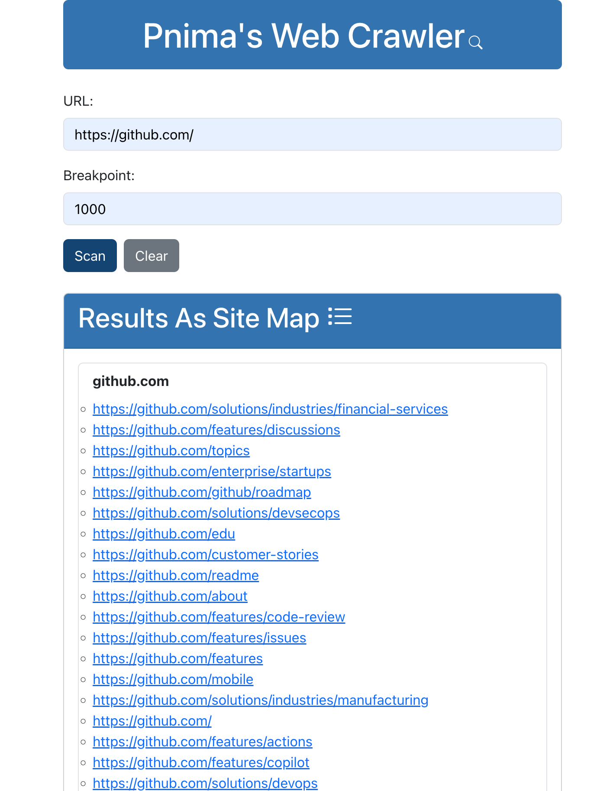
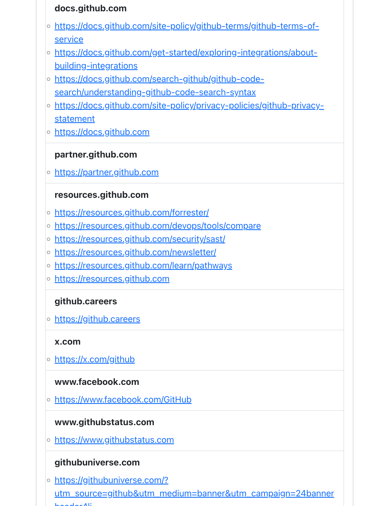

# Description

An asynchronous web crawler implemented using Spring Boot and resulting Sitemap being rendered in React.

# Feature

* The web crawler is restricted to a single domain. For example, starting with https://github.com/, it will crawl all pages within the GitHub domain but will not follow external links such as those to Facebook or Twitter.

* Upon receiving a URL, the crawler generates a simple site map, illustrating the links between the pages.

* The resulting sitemap is rendered using React.

# Screenshots

# Work-flow:

# Asynchronous Web crawling Process:

## Step 1: Starting the Crawler:

For instance, lets provide **https://github.com/** as our root URL and want to retrieve all links from this website.

## Step 2: Create a HttpClient:
 
 A new **HttpClient** is created using the builder pattern. The executor method of the builder is used to set a custom **Executor** for handling asynchronous tasks. That way the HttpClient uses this executor service to manage its threads for asynchronous tasks, such as sending HTTP requests and receiving responses. This configuration is crucial because the web crawler might need to send multiple HTTP requests concurrently to fetch and process web pages.

## Step 3: Send an Asynchronous HTTP Request:

An asynchronous HTTP GET request is submitted using **HttpClient.sendAsync** to the root URL.

## Step 4: Non-blocking Response Handling:

The response is handled non-blockingly using **thenApply** and **thenAccept**. This allows the crawler to continue processing other tasks while waiting for the response. The web server at **github.com** responds with the HTML content of the homepage. 

## Step 5: Parsing the HTML Content:

**JSoup** Java library is used to parse the HTML content and  extract all the URLs present on the homepage, basically extract all anchor tags.

## Step 6: Continuation and Chaining:

The crawler then sends HTTP requests to each of these URLs and repeats the above steps. The **CompletableFuture** API allows chaining multiple asynchronous operations, making it easier to build complex workflows without blocking.

# Tech Stack:

* Java
* Spring Boot
* Maven
* React

# Prerequisite

* Ensure you have Maven installed. You can verify this by running mvn -v in your terminal.

* Ensure you have JDK installed. You can verify this by running java -version in your terminal.

* Ensure you have Node.js and npm (Node Package Manager) installed. You can verify this by running node -v and npm -v in your terminal.

# Testing

1. Navigate to the backend service project directory and run command:

`mvn clean install && mvn spring-boot:run`

2. Navigate to the React client project directory and run command:

`npm install && npm start`

3. You can also test the application on POSTMAN or Curl to request this endpoint:

`Method  - POST `
 
`URL  -  http://localhost:8080/webcrawler/scan	 `

`Body - { "url": "https://github.com/", "breakPoint": 100, "domainOnly": false} `
